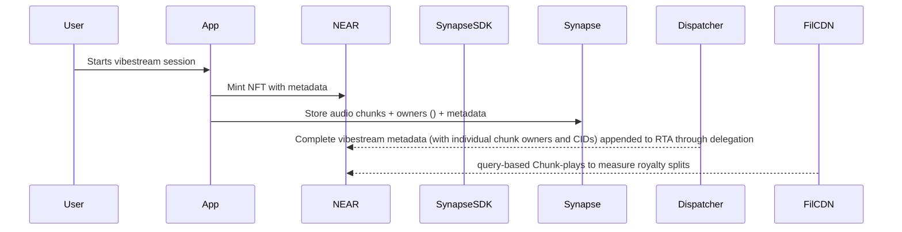

# VibesFlow NEAR Protocol Integration

## Deployed Contracts

### RTA v2 Contract (`near/contracts/rtav2/`)

Our NEAR smart contract implements **NEP-171** (Non-Fungible Token) and **NEP-366** (Delegation) standards to create unique NFTs for each vibestream session.

- **Features**:
  - Dynamic NFT creation for vibestreams
  - Chunk data management with ownership tracking
  - Editable metadata (till session ends) through delegation
  - RTA finalization when streams close

### Agents Contracts
- **Features**:
  - Worker registration and management
  - Cross-chain signatures (NEAR/Filecoin)
  - Workflow orchestration for individual Agent's tasks
  - MPC signatures via Chain Signatures

## Next steps:

### Restoring Shade Agents (Chunker, Dispatcher) for:
    - improved backend performance and reducing overhead 
    - on-chain raffling (VRF) of chunk owners
    - using "swarms" (of workers) to replace EC2 to speed-up parallel uploading and more reliable metadata structuring and compilation

### Deploying and integrating contracts:
    - ppm.vibesflow.testnet: a "global" contract for pay-per-minute access to vibestreams.
    - subscription.vibesflow.testnet: 5 NEAR / month for limitless access to the Vibe Market (playback streaming platform of completed RTAs)
    - royalties.vibesflow.testnet: royalty distribution based on amount of monthly plays for the individual chunk (not the entire vibestream)

