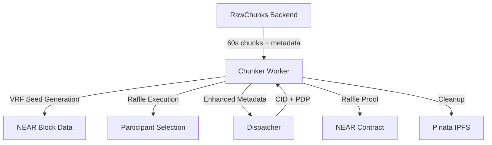

# VibesFlow Workers - NEAR Shade Agents Production Deployment

Walkthrough following Shade Agents patterns.

## Overview

VibesFlow implements two worker agents:
- **Dispatcher Worker** (Port 3000): Handles Filecoin storage via Synapse SDK 
- **Chunker Worker** (Port 3001): Handles 60-second audio chunking with VRF raffles

Both workers follow the shade-agent-js pattern with:
- TEE-derived worker accounts 
- Real hardware attestation on Phala Cloud
- NEAR Chain Signatures integration
- Production contract integration

## Prerequisites

1. **NEAR Accounts**:
   - `dispatcher.vibesflow.testnet` (funded with 1+ NEAR)
   - `chunker.vibesflow.testnet` (funded with 1+ NEAR)

2. **Deployed Contracts**:
   - `v1dispatcher.vibesflow.testnet` 
   - `v1chunker.vibesflow.testnet`

3. **Filecoin Wallet** (for dispatcher):
   - Funded with 150+ USDFC on Calibration network
   - Address: `0xedD801D6c993B3c8052e485825A725ee09F1ff4D`